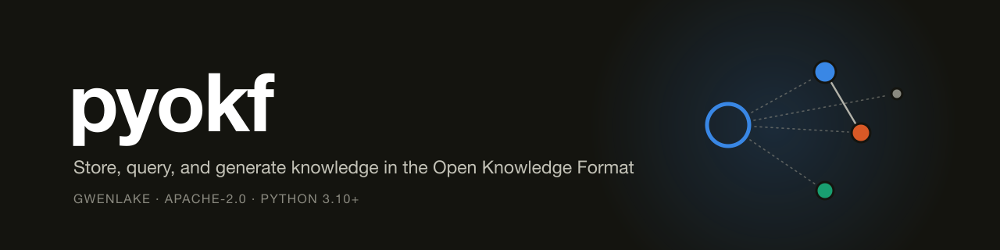
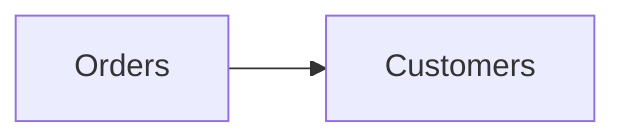

**A Python library for the [Open Knowledge Format (OKF)](https://github.com/GoogleCloudPlatform/knowledge-catalog/tree/main/okf)** — store, query, validate, visualize, and auto-generate knowledge bundles that both humans and AI agents can read.

Developed and maintained by [Gwenlake](https://gwenlake.com).

[](https://github.com/gwenlake/pyokf/actions)
[](https://pypi.org/project/pyokf/)
[](https://pypi.org/project/pyokf/)
[](LICENSE)

---

## What is OKF?

OKF is an open, vendor-neutral specification published by Google Cloud (June 2026). It represents knowledge — metric definitions, table schemas, runbooks, notes, anything — as **a directory of markdown files with YAML frontmatter**. Each file is a *concept*; markdown links between files form a knowledge graph; the whole directory is a *bundle* you can `git clone`, diff, and ship anywhere.

No SDK, no runtime, no lock-in. The format is the contract. `pyokf` gives you the tooling on top: a clean Python API, a CLI, trust-signal support (OKF v0.2), and LLM-powered ingestion.

```
my_bundle/
├── index.md                 # auto-generated directory listing
├── log.md                   # dated update history
├── metrics/
│   └── revenue.md           # one concept = one markdown file
└── tables/
    └── orders.md
```

```markdown
---
type: Metric
title: Revenue
description: Recognized revenue under the FY2026 policy.
tags: [finance]
generated: { by: reference_agent/gemini-2.5-pro, at: 2026-06-30T14:00:00Z }
verified:
  - { by: human:jsmith@acme, at: 2026-07-01T09:00:00Z }
status: stable
stale_after: 2026-12-31
---

# Definition

Sum of delivered orders, net of returns. Joins on [orders](/tables/orders.md).
```

## Features

- **Full OKF v0.1 + v0.2 support** — required/recommended frontmatter, concept IDs, cross-links, `index.md` / `log.md` conventions, permissive consumption (unknown keys preserved, broken links tolerated), and the v0.2 signal families: `generated`, `verified`, `status`, `stale_after`, `sources`.
- **Trust tiers** — derive `unverified` / `machine-confirmed` / `human-reviewed` from verification stamps, and filter on them before reading a single body.
- **Validation** — conformance checking per SPEC §9, plus non-blocking v0.2 warnings (stale concepts, unknown statuses, dangling `[^source]` footnotes).
- **See the graph** — `pyokf view` opens an interactive, self-contained HTML page (force-directed, clustered by directory, searchable); plus DOT, Mermaid (renders natively on GitHub) and JSON exports, with broken-link targets shown as ghost nodes.
- **LLM ingestion** — send raw text *or a whole directory of documents* (md, txt, html, csv, json, code; PDF/Word via `pyokf[docs]`), get well-formed, cross-linked OKF concepts back with per-file provenance. Anthropic API by default; any provider via a one-function plug.
- **Retrieval** — BM25 ranking (pure Python, accent-insensitive, frontmatter-weighted) for short textual queries, plus `pyokf ask`: retrieve-then-answer over your own knowledge.
- **MCP server** — one command serves the bundle to Claude (Code, Desktop, claude.ai) so it can search and read your knowledge base while answering.
- **A friendly CLI** — `pyokf init | add | list | show | verify | validate | search | query | ask | stale | graph | view | stats | log | export | ingest | mcp`. It works on the bundle you are inside, like `git`: `cd` once, then no path to repeat.
- **Zero heavy dependencies** — just PyYAML. Typed (`py.typed`), tested, linted.

## Installation

With [uv](https://docs.astral.sh/uv/) (recommended):

```bash
uv add pyokf          # as a project dependency
uvx pyokf --help      # or run the CLI without installing
```

With pip:

```bash
pip install pyokf
```

### Reading PDF and Word: the `docs` extra

The core installs **PyYAML and nothing else**. Reading `.pdf` and `.docx` needs two more
libraries, so they are an *optional extra* rather than a dependency everyone pays for:

```toml
[project.optional-dependencies]
docs = ["pypdf>=4", "python-docx>=1"]
```

`pyokf.readers` imports them **lazily**, inside `read_text()`, only when such a file shows
up. Without the extra nothing crashes — the file is simply reported and skipped, and the
run continues:

```
mon_rapport.pdf -> skipped: mon_rapport.pdf: PDF support requires `pip install pyokf[docs]`
```

Which is fine for a stray PDF, and useless if your whole source folder is PDFs — you would
get *n* skipped files and zero concepts. Install the extra the way that matches how you run
pyokf:

```bash
uv add "pyokf[docs]"                        # in your project
uvx --from "pyokf[docs]" pyokf ingest ~/docs  # one-shot, nothing installed
pip install "pyokf[docs]"                   # with pip
```

Working **inside a clone of this repository**, `uv sync --dev` gives you the core only, so
pass the extra to `uv run`:

```bash
uv run --extra docs pyokf ingest ~/docs
```

You can install it once with `uv sync --extra docs` and drop the flag afterwards — but be
aware that a later plain `uv sync` prunes the extra back out of the environment. Keeping
`--extra docs` on the command is the form that always works.

## Quickstart: turn a folder of documents into a knowledge base

Point `pyokf` at a directory and let the LLM do the reading. Three commands, no Python:

```bash
export ANTHROPIC_API_KEY=sk-ant-...

pyokf init kb && cd kb     # 1. create a bundle and step into it
pyokf ingest ~/docs        # 2. read every document, write OKF concepts
pyokf view                 # 3. look at the result in your browser
```

Like `git` and `uv`, the CLI works on the bundle you are **inside**: once you `cd` into
one, no command repeats its path. From elsewhere — a script, CI — point at it with `-C`:

```bash
pyokf -C ~/work/kb stats
```

`ingest` takes a directory, a single file, or `-` for stdin. On a directory it walks it
recursively and prints what each file became:

```
$ pyokf ingest ~/docs --prefix docs
Ingesting docs with claude-sonnet-5
  [1/3] finance/2026_budget.pdf ⚠ skipped: PDF support requires `pip install pyokf[docs]`
  [2/3] handbook/oncall.md ✓ 2 concepts
  [3/3] warehouse/orders.sql ✓ 1 concept
3 concepts from 3 files
```

Each line is printed **before** its LLM call, so a long run shows what it is working on
rather than sitting silent — one call per file means a folder of 30 documents takes
minutes. Colour is used only on a terminal, and never when `NO_COLOR` is set.

What it does for you:

- **One LLM call per file** — a document that can't be read is reported as `skipped` and the run continues.
- **Reads md, txt, rst, csv, json, yaml, html and source code out of the box**; PDF and Word need the [`docs` extra](#reading-pdf-and-word-the-docs-extra). Files of any other type are ignored, hidden files too.
- **Provenance for free** — each concept records its originating file in `sources`, is stamped `generated: {by: pyokf/<model>}`, and starts **unverified**.
- **Never overwrites** — ID collisions get a numeric suffix, and every run is appended to `log.md`.
- **Steerable** — `--prefix docs` nests the new concepts, `--hint "type: Playbook, tag: oncall"` steers the LLM, `--model` picks the model (see below).

### Choosing the model

Ingestion is mostly reading and structuring, so a small model does it well and costs
noticeably less. Pick per run, or once for the whole shell:

```bash
pyokf ingest ~/docs --model claude-haiku-4-5   # per run
export PYOKF_MODEL=claude-haiku-4-5            # for every command in this shell
```

| Model | Input / output per Mtok | Good for |
|---|---|---|
| `claude-haiku-4-5` | $1 / $5 | Bulk ingestion — extraction and structuring at 3× less than Sonnet |
| `claude-sonnet-5` (default) | $3 / $15 | Denser or more ambiguous sources, and `pyokf ask` |

The same flag works on `pyokf ask`, where the model reasons over the retrieved concepts
rather than just restructuring text — the tier that pays off there is not necessarily the
one you ingest with.

The bundle is immediately usable — and reviewable:

```bash
pyokf query "oncall escalation"                # BM25 ranking, instant, no LLM
pyokf ask "who do I page after 20 minutes?"    # RAG answer with cited concept IDs
pyokf list --tier unverified                   # your review queue
pyokf verify docs/oncall-rotation --by human:you@example.com
pyokf validate                                 # CI-friendly conformance check
pyokf view                                     # interactive graph in your browser
```

Everything written is plain markdown in `kb` — `git diff` it, edit it by hand, ship it anywhere.

## Quickstart (Python)

```python
from datetime import date
from pyokf import Bundle

bundle = Bundle()

concept = bundle.create(
    "metrics/revenue",
    type="Metric",
    title="Revenue",
    description="Recognized revenue under the FY2026 policy.",
    tags=["finance"],
    status="stable",                    # draft / stable / deprecated
    stale_after=date(2026, 12, 31),     # absolute date → deterministic staleness
    body="# Definition\n\nSum of delivered orders, net of returns.\n",
)

# Trust signals (OKF v0.2)
concept.verify(by="human:jsmith@acme")
concept.trust_tier                      # 'human-reviewed'

# Persist: writes concept files + index.md per directory + okf_version
bundle.save("my_bundle")
bundle.append_log("my_bundle", "Created [Revenue](/metrics/revenue.md).", kind="Creation")

# Reload and query
b = Bundle.load("my_bundle")            # or Bundle.load_archive("bundle.tar.gz")
b["metrics/revenue"].title              # mapping-style access by concept ID
b.by_type("Metric")
b.by_tag("finance")
b.by_trust_tier("human-reviewed")       # e.g. only surface these on a dashboard
b.active()                              # neither deprecated nor stale
b.search("returns")
b.graph()                               # {'metrics/revenue': {'tables/orders'}, ...}

# Validate (permissive: v0.2 issues are warnings, never fatal)
report = b.validate()
print(report.conformant, report, sep="\n")
```

## The CLI

Every command below runs from inside the bundle — `cd kb` once, then:

```bash
pyokf add notes/idea --type Note --title "Idea" -d "Worth exploring." --tag inbox
pyokf list --tier human-reviewed --status stable
pyokf show notes/idea
pyokf verify notes/idea --by human:you@example.com
pyokf validate                # exit code 1 if non-conformant → CI-friendly
pyokf search "exploring"
pyokf stale --on 2027-01-01   # what needs re-verification by then?
pyokf stats                   # counts by type / tier / status, broken links
pyokf view                    # interactive HTML graph in the browser
pyokf graph --format mermaid  # or dot | json | html
pyokf export kb.tar.gz
pyokf ingest ./docs           # directory, file, or '-' -> knowledge (LLM)
pyokf query "short query"     # BM25 retrieval, no LLM
pyokf ask "a question"        # RAG over the bundle
pyokf mcp                     # serve to Claude via MCP
```

`pyokf init` accepts a directory (`pyokf init kb`, or nothing for the current one).
Anything else takes `-C PATH` to work on a bundle you are not inside — `-C` goes before
or after the subcommand, so both `pyokf -C kb stats` and `pyokf stats -C kb` work.

## See the whole graph: `pyokf view`

`pyokf view` writes `graph.html` at the bundle root and opens it. It is a single
self-contained file — no CDN, no build step, nothing fetched — so you can commit it or
send it to someone.

It draws **two structures at once**, because a bundle has two:

- **Folders** — a hollow node per directory, `papers` → `papers/legislative` → the concepts
  inside, joined by dotted lines. Freshly ingested concepts rarely link to each other yet,
  so without this the graph is a scatter of isolated dots. Toggle it off with **Folders**
  to see the pure OKF link graph.
- **Markdown links** — the knowledge graph proper (SPEC §5), solid lines between concepts,
  with broken links shown as dashed rings: knowledge referenced but not written yet.

- **Colour = top-level directory** (the three largest; the rest share a neutral); filled
  dot = concept, hollow ring = folder, **size** = links for a concept, contents for a folder.
- **Drag a node and the rest rearranges around it** — the layout stays live while you hold
  it, and the graph re-settles when you let go. Scroll to zoom, drag the background to pan.
- Search to highlight, click a concept for its type, trust tier, status, folder and both
  link directions, and a **Table** toggle for the same data as text.
- Light and dark are each their own validated palette, not an automatic flip.

```bash
pyokf view                          # write + open
pyokf view -o /tmp/kb.html --no-open  # just write it (CI, a static site, an email)
```

For a graph you can paste into a GitHub README or PR description, use Mermaid instead:

```bash
pyokf graph --format mermaid
```



## Find things again: `query` and `ask`

```bash
pyokf query "alerte fraicheur"        # ranked concepts + snippets (no LLM, instant)
pyokf ask "comment est calculé le CA ?"   # RAG: retrieve top concepts, LLM answers, sources cited
```

```python
from pyokf.search import Index
from pyokf.llm import ask

hits = Index(bundle).query("chiffre d'affaires", limit=5)
answer, sources = ask(bundle, "comment est calculé le CA ?")
```

`query` is deterministic BM25 — accent-insensitive, with title/tags/description weighted above the body. `ask` feeds the top hits to the LLM with a strict "answer only from this knowledge, cite concept IDs" system prompt.

## Connect it to Claude (MCP)

Serve any bundle as an [MCP](https://modelcontextprotocol.io) server — Claude can then search and read your knowledge base while answering you:

```bash
# Claude Code
claude mcp add my-kb -- pyokf -C /path/to/kb mcp

# Claude Desktop (mcpServers config)
{"mcpServers": {"my-kb": {"command": "pyokf", "args": ["-C", "/path/to/kb", "mcp"]}}}
```

The server is launched by Claude, not from your shell, so give it the bundle explicitly
with `-C` rather than relying on the current directory.

The server exposes three tools — `search_knowledge`, `read_concept`, `list_concepts` — over stdio, stdlib only. Then just tell Claude: *"use the my-kb knowledge base to answer my questions."*

## LLM ingestion: text in, knowledge out

The most valuable OKF bundles are written continuously — often by agents. Beyond the whole-directory pass shown [above](#quickstart-turn-a-folder-of-documents-into-a-knowledge-base), `pyokf ingest` turns any single blob of raw text — meeting notes, a pasted spec, a data dictionary dump, stdin — into structured, cross-linked concepts:

```bash
export ANTHROPIC_API_KEY=sk-ant-...
pyokf ingest meeting_notes.txt --prefix notes
cat schema_dump.md | pyokf ingest - --hint "type: Table, tag: warehouse"
```

The LLM decides how to split the text, writes the frontmatter and a structured markdown body in the input's language, and links related concepts it creates together. Three guarantees, aligned with the v0.2 trust model:

1. Generated concepts are stamped `generated: {by: pyokf/<model>, at: ...}` and start **unverified** — review them, then `pyokf verify` to raise the tier.
2. Nothing is silently overwritten: ID collisions get a numeric suffix, and every ingestion is recorded in `log.md`.
3. The library never executes anything from a bundle (per the spec, OKF records computations; it doesn't run them).

From Python, plug in **any** LLM provider with a single callable:

```python
from pyokf import Bundle
from pyokf.llm import ingest_dir, ingest_text

b = Bundle.load("kb")
ids = ingest_text(b, raw_text)                          # Anthropic API (default)
ids = ingest_text(b, raw_text, complete=my_local_llm)   # complete(system, user) -> str
report = ingest_dir(b, "./docs", prefix="docs")         # {file: [ids] | "skipped: ..."}
b.save("kb")
```

## API overview

| Object | Highlights |
|---|---|
| `Concept` | `from_text` / `to_text` (lossless round-trip, unknown keys preserved), `links()`, `trust_tier`, `effective_status`, `is_stale()`, `verify()`, `footnote_refs()` |
| `Bundle` | dict-style access, `create`, `load` / `save` / `load_archive` / `export_archive`, `by_type` / `by_tag` / `by_status` / `by_trust_tier`, `stale` / `active`, `search`, `graph`, `stats`, `validate`, `make_index`, `append_log` |
| `pyokf.graph` | `to_html` (interactive page), `to_dot`, `to_mermaid`, `to_json` |
| discovery | `find_bundle_root()` / `is_bundle_root()` — how the CLI finds the bundle you are in |
| `pyokf.llm` | `ingest_text`, `ingest_dir`, `ask`, `anthropic_complete`, pluggable `Completer` |
| `pyokf.search` | `Index` (BM25), `Hit` |
| `pyokf.readers` | `read_text`, `iter_documents` (md, txt, html, csv, json, code; PDF/docx via `[docs]`) |
| `pyokf.mcp` | `MCPServer` — stdio MCP server for Claude and other clients |
| `Stamp`, `Source` | v0.2 `{by, at}` stamps and provenance entries with credibility signals |

## Development

```bash
git clone https://github.com/gwenlake/pyokf && cd pyokf
uv sync --dev
uv run pytest tests/ -q
uv run ruff check pyokf tests
uv build
```

The test suite needs no API key and no network — LLM features run through an injected fake
completer. It covers the stdlib readers only; PDF and Word extraction is not exercised, so
run with `--extra docs` (see [above](#reading-pdf-and-word-the-docs-extra)) if you touch
`readers.py`.

## Spec compliance notes

- Reads **v0.1 bundles unchanged**; the legacy `timestamp` field maps onto `generated.at` and is re-serialized in v0.2 form, as the compatibility rename prescribes.
- Writes the `okf_version` declaration in the bundle-root `index.md` frontmatter (SPEC §11) and reads it back.
- Consumption is deliberately permissive (SPEC §9): unknown types, unknown keys, and broken links never cause a rejection — broken links may simply be not-yet-written knowledge.
- Attested Computation fields (`runtime`, `parameters`, `executor`, `attester`) round-trip via `extra`; execution and attestation are consumer concerns by design.

## About

`pyokf` is developed and maintained by [Gwenlake](https://gwenlake.com). Issues and pull
requests are welcome on [github.com/gwenlake/pyokf](https://github.com/gwenlake/pyokf).

## License

[Apache-2.0](LICENSE) © Gwenlake

OKF is an open specification by the Google Cloud Data Cloud team — see the [spec and reference implementations](https://github.com/GoogleCloudPlatform/knowledge-catalog/tree/main/okf).
